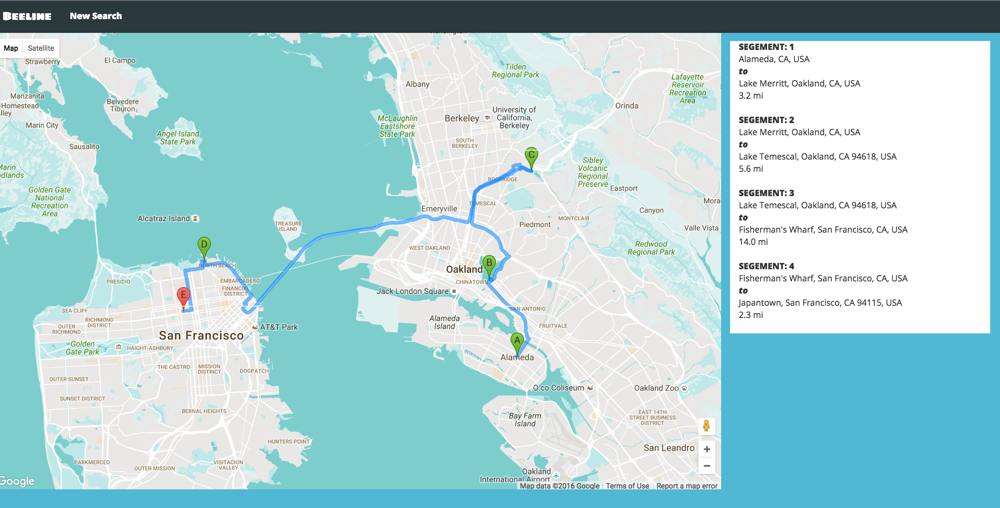

Beeline
--------

**Description**

Beeline is a itinerary-building app that helps vacationers find the optimal driving route for up to 5 destinations, including the origin. "Optimal" is defined as always choosing the nearest stop in relation to user's current location.

### Table of Contents
- [Features](#features)
- [Technology Stack](#tech-stack)
- [Testing Coverage](#testing)
- [How To Run Locally](#run-local)
- [Looking Ahead](#future)

## <a name='features'></a>Features

**Location Submission (up to 5 incl. origin)**


**Autocomplete Location Submissions**


**Itinerary Algorithm Based on Finding-Nearest-Stop-to-Current-Location**




## <a name="tech-stack"></a>Technology Stack

**Application:** Python, Flask, Jinja, Google Maps Services Python library 
**Front-End**: HTML/CSS, Bootstrap, JQuery, JavaScript  
**APIs:** Google Maps Distance Matrix API, Google Places API Web Service, Google Maps Directions API, Google Maps Geocoding API 


## <a name='testing'></a>Testing Coverage


## <a name="run-local"></a>How To Run Locally

Need TWO Google Maps API keys: Browser Key and Server Key
https://console.developers.google.com
Make sure to store keys in a secrets.sh and put the file in your `.gitignore`.

Create a virtual environment 

```
> virtualenv env
> source env/bin/activate
```

Install the dependencies

```
> pip install -r requirements.txt
```

In a new Terminal run App
```
> python server.py
```

## <a name="future"></a>Looking Ahead
###Algorithm Refinement
- Minimizing backtracking
- Explore optimization using networkx library single-source shortest path or A* algorithm

###Features
- User can login in and save their route
- Database to stored searched-routes


Author: [Katia Wu](https://www.linkedin.com/in/katiayx) 
  
 